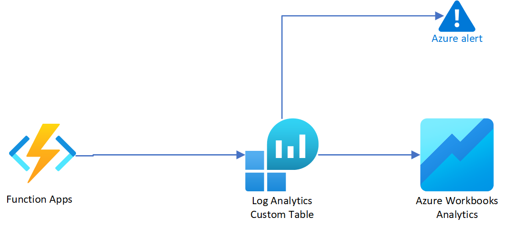

# Monitoring Solution for Azure VNet Utilization

## Overview

This comprehensive solution is designed to monitor and manage the utilization of Virtual Networks (VNets) in your Azure environment. It consists of four key components, each playing a crucial role in ensuring the efficiency and reliability of your network resources. 

### Azure Function

The Azure Function serves as the core of this solution. It periodically collects detailed data about each subnet within your VNets, capturing essential metrics such as the total number of IP addresses, used IP addresses, and available IP addresses. However, its significance goes beyond data collection. It evaluates a critical condition: whether the used IP count in a subnet exceeds 80% of the total IP count for that subnet. When this condition is met, the function assigns a value of 1, indicating a potential issue with subnet utilization. Conversely, if the condition is not met, it assigns a value of 0. This value serves as a trigger for the Azure Alert component.

### Log Analytics (Custom Table)

The data collected by the Azure Function is securely stored in a Log Analytics custom table. This table acts as a centralized repository for your VNet utilization data, providing easy access, querying, and analysis capabilities. The data is structured in a JSON format, facilitating efficient storage and retrieval. This component serves as the foundation for both visualization and alerting.

### Azure Workbook

Azure Workbook complements this solution by offering powerful visualization capabilities. It allows you to create insightful dashboards and reports to gain a holistic view of your VNet utilization. By leveraging the data stored in the Log Analytics custom table, you can monitor trends, identify anomalies, and make informed decisions to optimize your Azure network resources. The Workbook helps transform raw data into actionable insights.

### Azure Alert

The Azure Alert component plays a vital role in ensuring proactive network management. It continuously monitors the condition values generated by the Azure Function. When a condition value of 1 is detected, signifying that the utilization of a subnet has exceeded 80%, the alert is triggered. This immediate notification enables you to take timely corrective actions, preventing potential network issues and service disruptions.

This integrated solution empowers you to maintain the health and efficiency of your Azure VNets. It combines data collection, storage, visualization, and alerting into a cohesive framework, providing you with the tools needed to proactively manage and optimize your network resources.

## Purpose

The primary purpose of this solution is to provide insights into VNet utilization. By analyzing the utilization of subnets within your VNets, you can proactively manage and allocate resources, ensuring that your Azure environment operates efficiently.

## How It Works

This solution is implemented using an Azure Function written in PowerShell. Here's how it works:

1. The Azure Function is triggered at defined intervals (e.g., every 5 minutes) using a TimerTrigger.

2. The function collects data about your VNets, including subnet details such as address space, total IP count, used IP count, and available IP count.

3. It evaluates the utilization condition for each subnet. If the used IP count is greater than or equal to 80% of the total IP count, it assigns a value of 1; otherwise, it assigns a value of 0.

4. The results, including the condition values, are formatted as JSON and stored securely in a custom table within Azure Log Analytics.

5. You can use Azure Workbook to create customized visualizations and dashboards to monitor your VNet utilization trends over time.

6. Azure Alert continuously monitors the condition values. If it detects a condition value of 1, indicating high subnet utilization, it triggers an alert for immediate notification.

### Data Collection Rules (DCR) and Data Collection Endpoint (DCE)

The Data Collection Rules (DCR) define the data collection schema and configuration for Log Analytics. It specifies which data to collect, how to process it, and where to store it.

The Data Collection Endpoint (DCE) is the destination where the collected data is sent. In this solution, the DCE is set to "https://vnet-data-svv3.westeurope-1.ingest.monitor.azure.com," which is the Log Analytics workspace endpoint.

Together, the DCR and DCE enable the seamless flow of data from the Azure Function to the Log Analytics Custom Table, allowing you to monitor your VNets effectively.

## Prerequisites

Before implementing this solution, make sure you have the following prerequisites in place:

- An Azure subscription with sufficient permissions to create Azure Function, Log Analytics, Workbook, and Alert resources.

- PowerShell scripting knowledge to understand and modify the Azure Function code as needed.

## Configuration

1. Create an Azure Function using the provided PowerShell script.

2. Configure the TimerTrigger to run the function at your desired intervals.

3. Set up Azure Log Analytics and create a custom table to store the VNet utilization data.

4. Configure Azure Workbook to visualize the data from the custom table.

5. Create an Azure Alert to monitor the condition values generated by the function.

